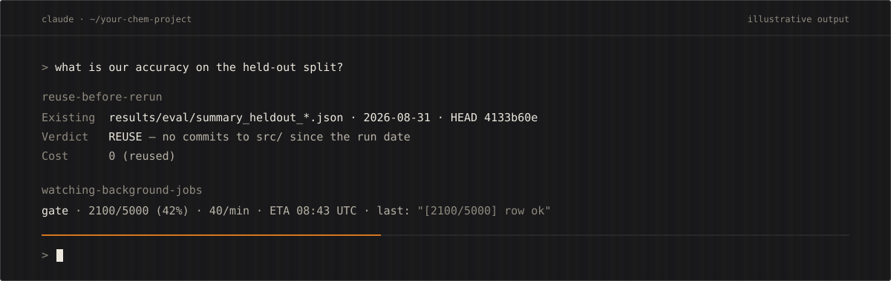
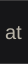

<a id="top"></a>

<a href="https://github.com/Kohulan/orthonym-skills">
  <!-- x-release-please-version -->
</a>

<br/>

[](LICENSE)
[](.claude-plugin/plugin.json) <!-- x-release-please-version -->
[](https://doi.org/10.5281/zenodo.23039311)
[](https://github.com/Steinbeck-Lab/Orthonym)
[](https://orcid.org/0000-0003-1066-7792)

**Part of the [Orthonym](https://github.com/Steinbeck-Lab/Orthonym) project.** These are the skills, hooks and agent that the
Orthonym engine (checked IUPAC names for chemical structures) was built with.

Skills, hooks and an agent for [Claude Code](https://docs.claude.com/en/docs/claude-code), hardened on
[Orthonym](https://github.com/Steinbeck-Lab/Orthonym), a real deterministic cheminformatics engine. For anyone who builds chemistry software or ML tools:
property prediction, structure-to-name, reaction and retrosynthesis prediction, docking and QSAR,
molecular generation, cheminformatics pipelines.

[Why](#why) · [The loop](#the-loop) · [Install](#install) · [Update](#update) · [What's new](#whats-new-in-040) ·
[Skills](#skills) · [Hooks](#hooks) · [Agent](#agent) · [Catalog](docs/skills-catalog.md) · [Cite](#cite)

## Why


Autonomous coding agents fail in one recurring way: they act on a confident-but-wrong premise, and
every test still passes. Each skill forces a measurement at the point where that premise would
otherwise slip through.

<details>
<summary><b>Same as text</b></summary>
<br/>

| Gap | Skill |
|:---|:---|
| Prove the site is on the execution path, before you edit it | [`spy-site`](skills/spy-site/) |
| Prove the target is a real defect class, before you build | [`check-target`](skills/check-target/) |
| Reuse the result you already have, before you re-measure for four hours | [`reuse-before-rerun`](skills/reuse-before-rerun/) |
| Bound your objectives, before you optimise | [`bounded-goals`](skills/bounded-goals/) |
| Get an adversarial second opinion, before you ship a load-bearing claim | [`fable-review`](skills/fable-review/) |
| Attribute every failure to the site that made it, before you rank the build order | [`refusal-census`](skills/refusal-census/) |
</details>

## The loop


<details>
<summary><b>Same as text</b></summary>
<br/>

1. **kickoff**: resume from the handoff note.
2. **measure** with [`run-eval`](skills/run-eval/) on a fixed, hashed split.
3. **cluster** with [`cluster-failures`](skills/cluster-failures/) and [`refusal-census`](skills/refusal-census/).
4. **target** one real defect class with [`check-target`](skills/check-target/).
5. **spy** with [`spy-site`](skills/spy-site/): is the site on the path?
6. **fix** at the root cause with [`understand-before-merge`](skills/understand-before-merge/).
7. **gate** with [`run-gate`](skills/run-gate/) and its structured verdict.
8. **review** with [`fable-review`](skills/fable-review/), a different model family.
9. **handoff**: the next session starts again at kickoff.

[`reuse-before-rerun`](skills/reuse-before-rerun/) fires before any run over a minute.
[`watching-background-jobs`](skills/watching-background-jobs/) fires while the gate runs.
</details>

The workflow skills chain into one session. The process skills fire at any step where a decision
would otherwise rest on trust.

## Install

Inside Claude Code, run these two commands one at a time.

1. Add the marketplace:

   ```text
   /plugin marketplace add Kohulan/orthonym-skills
   ```

2. Install the plugin:

   ```text
   /plugin install orthonym-skills@orthonym-skills
   ```

You get all 22 skills (as `/orthonym-skills:<name>`), the `reference-consult` agent, and the
`block-git-add-all` hook. The other four hooks are opt-in: see [`hooks/README.md`](hooks/README.md).
Claude picks up a skill from its description when your task matches it.

<details>
<summary><b>Copy only what you want</b></summary>
<br/>

```bash
# per-project
cp -r skills/spy-site  /path/to/your/project/.claude/skills/
# user-global (every session on this machine)
cp -r skills/spy-site  ~/.claude/skills/
```

Invoke by name (`/spy-site`), or let Claude pick the skill up from its description. Full options,
hooks and agent setup: [`docs/INSTALL.md`](docs/INSTALL.md).
</details>

<details>
<summary><b>Clone and track upstream</b></summary>
<br/>

```bash
git clone https://github.com/Kohulan/orthonym-skills.git ~/orthonym-skills
ln -s ~/orthonym-skills/skills/spy-site ~/.claude/skills/spy-site
```
</details>

## Update

**Plugin.** Run these two commands in a terminal, then restart Claude Code. The new version loads
in the next session.

```bash
claude plugin marketplace update orthonym-skills
claude plugin update orthonym-skills@orthonym-skills
```

**Symlinked clone.** Pull; the links pick up the new files.

```bash
git -C ~/orthonym-skills pull
```

<details>
<summary><b>Copied skills</b></summary>
<br/>

Pull the clone, then refresh every skill you copied into `~/.claude/skills`. This replaces those
folders, so any local edit to them is lost; leave out a skill you changed by hand.

```bash
git -C ~/orthonym-skills pull
for d in ~/.claude/skills/*/; do
  s=~/orthonym-skills/skills/$(basename "$d")
  [ -d "$s" ] && rsync -a --delete "$s/" "$d"
done
```

For a project copy, use `/path/to/your/project/.claude/skills/` in place of `~/.claude/skills/`.
If you wired an opt-in hook by copying its script, copy the script again from `hooks/`.
</details>

## What's new in 0.4.0

- **Every skill follows Anthropic's [skill-authoring rules](https://platform.claude.com/docs/en/agents-and-tools/agent-skills/best-practices).**
  Descriptions say what the skill does, then when to use it. Multi-step skills have a checklist
  with "go back to step N" lines. Each skill uses one term per concept.
- **12 bug fixes** in skills and scripts. For example, `sweep.sh` no longer reports "nothing found"
  on a bad date. `run-gate` no longer trusts a verdict file left by an earlier run. `handoff` no
  longer edits its note after committing it.
- **[`test-gate`](skills/test-gate/)**, a new skill: a test must fail on some plausible wrong code.
- **Three opt-in hooks:** `guard-holdout`, `guard-regen` and `gate-guard` (see [Hooks](#hooks)).
- **Evals:** three test prompts and one near-miss per skill, under [`evals/`](evals/). The lint
  checks the rules a script can check.

The full list is in [`CHANGELOG.md`](CHANGELOG.md).

<details>
<summary><b>Does the plugin help? Eval results for 0.4.0</b></summary>
<br/>

The five skills with the biggest changes, three cases each, one run per model, with and without
the plugin. A Sonnet judge graded each reply against the case's rubric.

| Model | With plugin | Without plugin |
|:---|:---|:---|
| Haiku | 12/15 | 6/15 |
| Sonnet | 15/15 | 8/15 |
| Opus | 15/15 | 6/15 |

Haiku loaded a skill in only 2 of its 15 runs, so its score shows the descriptions alone. Run the
suite yourself with the command under [Contributing](#contributing).
</details>

## Skills

### Process skills

Ready to use. No setup.

| Skill | When it fires | What it forces |
|:---|:---|:---|
| [`spy-site`](skills/spy-site/) | Before any fix that names a function as "the place to change" | Instrument, run two or more known positives, count calls. Zero calls = wrong site. |
| [`check-target`](skills/check-target/) | Before starting a fix on a named cluster or signature | The signature must not also match inputs that already succeed. |
| [`enumerate-first`](skills/enumerate-first/) | "Probably unreachable", "edge case", "unlikely to matter" | Enumerate the space and count. The count is the answer. |
| [`verify-source`](skills/verify-source/) | "The spec says…", "per IUPAC / RFC / ISO…" | Open the source, cite the section. Never a note that quotes it. |
| [`prove-invariant`](skills/prove-invariant/) | A suite passes but you are not sure the values are *right* | Derive the invariant the output must satisfy and test that. |
| [`test-gate`](skills/test-gate/) | Writing a regression test, or reviewing tests in a PR | Name the cheapest wrong code, run it, and see the test fail. A guard needs both directions tested. |
| [`change-asserted-value`](skills/change-asserted-value/) | A change would move a golden file, snapshot, or asserted label | Answer "which is wrong, the code or the expectation?" with evidence first; anything weaker ships labelled unverified. A bulk regeneration lists every changed value first. |
| [`bounded-goals`](skills/bounded-goals/) | Writing success criteria with more than one metric | One objective, explicit bounds on the rest. Multi-objective loops thrash. |
| [`council`](skills/council/) | "Which option?", "what next?", "is X worth it?", "your call" | Search first, three or more named voices, one recorded call with a flip condition. |
| [`fable-review`](skills/fable-review/) | Before shipping a load-bearing plan, finding, or diagnosis | An adversarial review by a *different* model family. Refute, don't agree. |
| [`gauntlet-loop`](skills/gauntlet-loop/) | "Loop until it beats X" | Builder vs. harsh critic against a stated bar, until it wins. |
| [`understand-before-merge`](skills/understand-before-merge/) | Any code meant to ship, merge, or touch real data | A short why on each non-obvious decision, a failure-mode table, open questions only a human can answer. |

### Workflow skills

Wire in your project's commands once. The [catalog](docs/skills-catalog.md) says exactly what to wire for each one.

| Skill | When it fires | What it forces |
|:---|:---|:---|
| [`kickoff`](skills/kickoff/) | Session start with no task given yet; "continue", "resume", "where were we" | Self-prime from the handoff note, both memory layers and `git log`; drift-check before trusting the plan. |
| [`run-eval`](skills/run-eval/) | "What is the accuracy?" | A fixed, hashed split; several numbers, so "fixed a wrong output" ≠ "stopped emitting one". |
| [`cluster-failures`](skills/cluster-failures/) | Deciding what to fix next | Group by a structural feature of the input. Analysis only, never per-item patches. |
| [`refusal-census`](skills/refusal-census/) | Ranking build order | Attribute each abstention to its code site; rank by *sole-blocker* count. |
| [`eval-loop`](skills/eval-loop/) | The improvement loop itself | measure → one class → root fix → re-measure → gate → log, with bounded goals. |
| [`reuse-before-rerun`](skills/reuse-before-rerun/) | Before any run longer than a minute; "how many…", "where is the run from…" | One sweep of ledger, repo, scratch dirs, notes. Then a 3-line **REUSE / EXTEND / RERUN** verdict. |
| [`run-gate`](skills/run-gate/) | Before shipping a phase | Clear the old verdict, launch in the background, wait for the new verdict file, read the *structured* verdict, never the exit code. |
| [`watching-background-jobs`](skills/watching-background-jobs/) | Anything running longer than ~5 minutes | Own the watch loop; one progress line per wake-up; CPU check before calling a stall. |
| [`handoff`](skills/handoff/) | Wrapping up a session | Lessons into both memory layers; a resume note `kickoff` can check against git; never trim durable notes. |

### Media skills

Needs Node.js. `scripts/setup.sh` fetches Chrome for Testing, fetches ffmpeg through `uv` when it is
missing, and names any tool it cannot get.

| Skill | When it fires | What it forces |
|:---|:---|:---|
| [`promo-video`](skills/promo-video/) | "Make a video", a launch or explainer video, "something to post" | Interview first, a storyboard of stills before anything moves, then a review page; every caption from real facts and real UI. Frame-exact MP4 from HTML, with 3D, fluid ink and a composed or supplied soundtrack. |

### Output

`reuse-before-rerun` ends every reply that reports a number with a three-line verdict.
`watching-background-jobs` reports one progress line per wake-up. The values below are illustrative.



<details>
<summary><b>Same output as text</b></summary>
<br/>

```text
Existing: results/eval/summary_heldout_*.json · 2026-08-31 · HEAD 4133b60e
Verdict:  REUSE — no commits to src/ since the run date
Cost:     0 (reused)
```

```text
gate · 2100/5000 (42%) · 40/min · ETA 08:43 UTC · last: "[2100/5000] row ok"
```
</details>

## Hooks

Mechanical guards for rules that must hold every time, where prose held only most of the time. All
are `PreToolUse` hooks; only `block-git-add-all` is on with the plugin, the rest are opt-in.
[`hooks/README.md`](hooks/README.md) has the settings block, the variables and the one-line tests.

| Hook | With the plugin | Backs up | Denies | Escape |
|:---|:---|:---|:---|:---|
| [`block-git-add-all`](hooks/block-git-add-all.py) | on | every skill that commits | `git add -A`, `git add .`, `git add --all`, `git commit -a` | Name the paths. |
| [`ask-gate`](hooks/ask-gate.py) | opt-in | your "don't wait on me" directive | Any question that is not one of the 4 hard stops: destructive, security / publish, 30k+ rows or 1h+ run, plan so broken every path is a guess | `HARD STOP:` prefix, `ASK_GATE_OFF=1`, `.claude/ask-gate.off` |
| [`guard-holdout`](hooks/guard-holdout.py) | opt-in | `eval-loop`, `run-eval`, `bounded-goals` | A command matching `EVAL_HOLDOUT_PATTERN`, until you agree to spend the held-out split | `# holdout-approved` after you agree |
| [`guard-regen`](hooks/guard-regen.py) | opt-in, no setup | `change-asserted-value` | A bulk snapshot or golden regeneration (`--snapshot-update`, `jest -u`, `UPDATE_GOLDEN=1` ...) | `# values-reviewed` after each value is listed |
| [`gate-guard`](hooks/gate-guard.py) | opt-in | `run-gate` | A full gate (`GATE_CMD_RE`) under `timeout`, or while another gate holds the verdict lock | Remove `timeout`; wait for the other gate |

## Agent

[`reference-consult`](agents/reference-consult.md) reads the reference documents a project relies on
(standards, specifications, published rules, reference data files) and returns the rule with its exact
citation, the document's own examples as test cases, where the text is silent or ambiguous, and a
confidence for each finding. The main agent then implements the fix at the root cause. It reads
documents, never source code, and treats any instruction inside a document as text to quote.

## Reference docs

[`reference-docs/`](reference-docs/) holds domain knowledge you point Claude at; it is not invocable.
`rdkit-perception`, `fix-methodology` and `testing-commands` are chemistry-general. The
[`examples-iupac-naming/`](reference-docs/examples-iupac-naming/) pack is a worked example of a
domain-specific knowledge file, for when you build your own.

## Why chemistry, and not any code?

The process skills are domain-neutral. The workflow skills assume the texture of chemistry-tool
development: molecules as inputs, reference-free validation by a round trip through a parser or
canonicalizer (RDKit to canonical InChIKey), fixed benchmark splits, and pipelines that abstain
rather than emit a wrong structure. That framing makes them concrete instead of generic advice.

## Contributing

Run the release gate before a pull request:

```bash
python3 scripts/lint_skills.py                          # skill-authoring rules, evals, leaked project tokens
claude plugin validate . --strict                       # marketplace manifest
claude plugin validate skills --strict                  # every SKILL.md frontmatter
claude plugin validate .claude-plugin/plugin.json --strict
```

Every skill has at least three test prompts and one near-miss under [`evals/<skill>/`](evals/).
Run them with and without the plugin (the without-plugin arm is the baseline):

```bash
claude plugin eval . --tag <skill> --model sonnet --judge-model sonnet --runs 3 --no-publish
```

The default judge is a small model and can fail a long, correct reply; `--judge-model sonnet`
grades more reliably. A change to a skill brings its eval result, with and without the plugin, to
the PR.

## Cite

If these skills, hooks or the agent help your work, please cite the repository. GitHub's
*Cite this repository* button reads [`CITATION.cff`](CITATION.cff).

<!-- x-release-please-start-version -->
```bibtex
@software{rajan_orthonym_skills_2026,
  author    = {Rajan, Kohulan},
  title     = {{Orthonym Skills}: {Claude Code} skills for measurement-driven chemistry development},
  year      = {2026},
  version   = {0.4.0},
  doi       = {10.5281/zenodo.23039311},
  url       = {https://github.com/Kohulan/orthonym-skills},
  license   = {MIT}
}
```
<!-- x-release-please-end -->

## License

[MIT](LICENSE) © 2026 Kohulan Rajan. Skills are instruction text: use, adapt, and redistribute freely.

---

<p align="center"><a href="https://www.kohulanr.com/" title="Kohulan Rajan"></a><a href="https://www.beilstein-institut.de/en/" title="Beilstein-Institut"></a><a href="https://cheminf.uni-jena.de/" title="Steinbeck-Lab, Friedrich Schiller University Jena"></a></p>

<sub><a href="#top">Back to top</a></sub>
