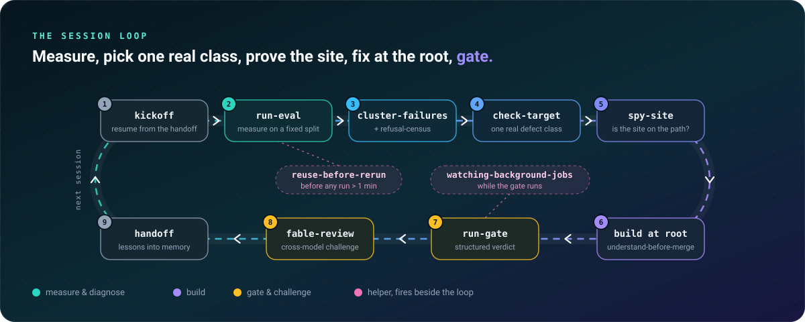

<div align="center">

<a id="top"></a>

<a href="https://github.com/Kohulan/orthonym-skills">
  
</a>

<br/><br/>

[](LICENSE)
[](#-install)
[](.claude-plugin/plugin.json)
[](#-cite)

[](#-the-skills)
[](#-hooks)
[](#-agent)
[](#-contributing)
[](https://orcid.org/0000-0003-1066-7792)

<br/>

### Decide from measurement, not from a confident guess.

Skills, hooks and an agent for [Claude Code](https://docs.claude.com/en/docs/claude-code).
Hardened on a real deterministic cheminformatics engine.<br/>
Generalized for anyone who builds **chemistry software or ML tools**.

<sub>property prediction · structure ↔ name · reaction &amp; retrosynthesis · docking &amp; QSAR · molecular generation · cheminformatics pipelines</sub>

<br/><br/>

<a href="#-install"><b>Install</b></a> &nbsp;·&nbsp;
<a href="#-the-loop"><b>The loop</b></a> &nbsp;·&nbsp;
<a href="#-the-skills"><b>Skills</b></a> &nbsp;·&nbsp;
<a href="#-hooks"><b>Hooks</b></a> &nbsp;·&nbsp;
<a href="#-agent"><b>Agent</b></a> &nbsp;·&nbsp;
<a href="docs/skills-catalog.md"><b>Catalog</b></a> &nbsp;·&nbsp;
<a href="#-cite"><b>Cite</b></a>

</div>

<br/>

## ⚡ Quick start

Two commands, inside Claude Code:

```text
/plugin marketplace add Kohulan/orthonym-skills
/plugin install orthonym-skills@orthonym-skills
```

That is all. Claude picks up each skill from its description when your task matches it.
You can also call a skill by name, for example `/orthonym-skills:spy-site`.

<br/>

## 🧪 Why this exists

<div align="center">
  
</div>

<br/>

Autonomous coding agents fail in one recurring way. They act on a **confident-but-wrong premise**,
and every test still passes, because tests check the code, not the reasoning.
Each skill here closes one gap in that chain.

<table>
<tr>
<td width="33%" valign="top">

### 🧭 11 process skills
Ready to use. No setup.<br/>
They fire wherever a decision is about to be made on trust.

<sub>`spy-site` · `check-target` · `enumerate-first` · `verify-source` · `prove-invariant` · `change-asserted-value` · `bounded-goals` · `council` · `fable-review` · `gauntlet-loop` · `understand-before-merge`</sub>

</td>
<td width="33%" valign="top">

### 🔁 9 workflow skills
Wire in your project's commands once.<br/>
They chain into one repeatable session.

<sub>`kickoff` · `run-eval` · `cluster-failures` · `refusal-census` · `eval-loop` · `reuse-before-rerun` · `run-gate` · `watching-background-jobs` · `handoff`</sub>

</td>
<td width="33%" valign="top">

### 🛡️ 2 hooks + 1 agent
Mechanical guards for the rules that prose kept losing under pressure.

<sub>`block-git-add-all` · `ask-gate` · `reference-consult`</sub>

</td>
</tr>
</table>

<br/>

## 🔄 The loop

<div align="center">
  
</div>

<br/>

The workflow skills chain into one session. The process skills fire at each step where a decision
would otherwise rest on trust.

<br/>

## 📦 Install

**As a plugin.** You get everything in two commands, inside Claude Code:

```text
/plugin marketplace add Kohulan/orthonym-skills
/plugin install orthonym-skills@orthonym-skills
```

You get all 20 skills (as `/orthonym-skills:<name>`), the `reference-consult` agent, and the
`block-git-add-all` hook. The `ask-gate` hook is opt-in. See [`hooks/README.md`](hooks/README.md).

<details>
<summary><b>Copy only what you want</b></summary>
<br/>

```bash
# per-project
cp -r skills/spy-site  /path/to/your/project/.claude/skills/
# user-global (every session on this machine)
cp -r skills/spy-site  ~/.claude/skills/
```

Invoke by name (`/spy-site`), or let Claude pick the skill up from its description when your task
matches. Full options, hooks and agent setup: [`docs/INSTALL.md`](docs/INSTALL.md).
</details>

<details>
<summary><b>Clone and track upstream</b></summary>
<br/>

```bash
git clone https://github.com/Kohulan/orthonym-skills.git ~/orthonym-skills
ln -s ~/orthonym-skills/skills/spy-site ~/.claude/skills/spy-site
git -C ~/orthonym-skills pull      # update
```
</details>

<br/>

## 🧰 The skills

### 🧭 Process skills · ready to use, no setup

| Skill | When it fires | What it forces |
|:---|:---|:---|
| [`spy-site`](skills/spy-site/) | Before any fix that names a function as "the place to change" | Instrument, run a known positive, count calls. Zero calls = wrong site. |
| [`check-target`](skills/check-target/) | Before starting a fix on a named cluster or signature | The signature must not also match inputs that already succeed. |
| [`enumerate-first`](skills/enumerate-first/) | "Probably unreachable", "edge case", "unlikely to matter" | Enumerate the space and count. The count is the answer. |
| [`verify-source`](skills/verify-source/) | "The spec says…", "per IUPAC / RFC / ISO…" | Open the source, cite the section. Never a note that quotes it. |
| [`prove-invariant`](skills/prove-invariant/) | A suite passes but you are not sure the values are *right* | Derive the invariant the output must satisfy and test that. |
| [`change-asserted-value`](skills/change-asserted-value/) | A change would move a golden file, snapshot, or asserted label | Answer "which is wrong, the code or the expectation?" with evidence first. |
| [`bounded-goals`](skills/bounded-goals/) | Writing success criteria with more than one metric | One objective, explicit bounds on the rest. Multi-objective loops thrash. |
| [`council`](skills/council/) | "Which option?", "what next?", "is X worth it?", "your call" | Search first, three named voices, one recorded call with a flip condition. |
| [`fable-review`](skills/fable-review/) | Before shipping a load-bearing plan, finding, or diagnosis | An adversarial review by a *different* model. Refute, don't agree. |
| [`gauntlet-loop`](skills/gauntlet-loop/) | "Loop until it beats X" | Builder vs. harsh critic against a stated bar, until it wins. |
| [`understand-before-merge`](skills/understand-before-merge/) | Any code meant to ship, merge, or touch real data | Inline reasoning, a failure-mode table, open questions only a human can answer. |

### 🔁 Workflow skills · wire in your project's commands once

| Skill | When it fires | What it forces |
|:---|:---|:---|
| [`kickoff`](skills/kickoff/) | Session start, "continue", "resume" | Self-prime from the handoff note, both memory layers and `git log`; drift-check before trusting the plan. |
| [`run-eval`](skills/run-eval/) | "What is the accuracy?" | A fixed, hashed split; several numbers, so "fixed a wrong output" ≠ "stopped emitting one". |
| [`cluster-failures`](skills/cluster-failures/) | Deciding what to fix next | Group by a structural feature of the input. Analysis only, never per-item patches. |
| [`refusal-census`](skills/refusal-census/) | Ranking build order | Attribute each abstention to its code site; rank by *sole-blocker* count. |
| [`eval-loop`](skills/eval-loop/) | The improvement loop itself | measure → one class → root fix → re-measure → gate → log, with bounded goals. |
| [`reuse-before-rerun`](skills/reuse-before-rerun/) | Before any run longer than a minute; "how many…", "where is the run from…" | One sweep of ledger, repo, scratch dirs, notes. Then a 3-line **REUSE / EXTEND / RERUN** verdict. |
| [`run-gate`](skills/run-gate/) | Before shipping a phase | Background launch, wait on the verdict file, read the *structured* verdict, never the exit code. |
| [`watching-background-jobs`](skills/watching-background-jobs/) | Anything running longer than ~5 minutes | Own the watch loop; one progress line per wake-up; CPU check before calling a stall. |
| [`handoff`](skills/handoff/) | Wrapping up a session | Lessons into both memory layers; a resume note; never trim durable notes. |

> [!TIP]
> Each skill has a full page in the [**skills catalog**](docs/skills-catalog.md): what it does, when it
> fires, and what to wire up before a workflow skill works in your project.

### 🖥️ What the output looks like

<div align="center">
  
</div>

<details>
<summary><b>Same output as plain text</b></summary>
<br/>

`reuse-before-rerun` ends every reply that reports a number with this block:

```text
Existing: results/h2h/summary_chebifull_*.json · 2026-08-31 · HEAD 4133b60e
Verdict:  REUSE — no commits to src/ since the run date
Cost:     0 (reused)
```

`watching-background-jobs` ends every wake-up that shows progress with one line:

```text
gate · 2100/5000 (42%) · 40/min · ETA 08:43 UTC · last: "[2100/5000] row ok"
```
</details>

<br/>

## 🛡️ Hooks

Mechanical guards for the two rules that prose instructions kept losing under pressure. Both are
`PreToolUse` hooks. [`hooks/README.md`](hooks/README.md) has the settings block and the one-line tests.

| Hook | Matcher | Denies | Escape |
|:---|:---|:---|:---|
| [`block-git-add-all`](hooks/block-git-add-all.py) | `Bash` | `git add -A`, `git add .`, `git add --all`, `git commit -a` | Name the paths. |
| [`ask-gate`](hooks/ask-gate.py) | `AskUserQuestion` | Any question that is not one of the 4 hard stops: destructive, security / publish, 30k+ rows or 1h+ run, plan so broken every path is a guess | `HARD STOP:` prefix, `ASK_GATE_OFF=1`, `.claude/ask-gate.off` |

## 🤖 Agent

[`reference-consult`](agents/reference-consult.md) is a subagent. It reads the reference documents a project relies on (standards, specifications, published rules, reference data files) and returns the rule:

- the rule, and the code site that holds it,
- the reference's own test cases,
- what the reference gets wrong,
- a confidence for each finding.

The main agent then implements the fix at the root cause.

> [!IMPORTANT]
> **Documents only, never source code.**

## 📚 Reference docs

[`reference-docs/`](reference-docs/) holds domain knowledge you point Claude at. You cannot invoke it.
`rdkit-perception`, `fix-methodology` and `testing-commands` are chemistry-general. The
[`examples-iupac-naming/`](reference-docs/examples-iupac-naming/) pack is a worked example of a
domain-specific knowledge file, for when you build your own.

## ⚗️ Why "chemistry" and not "any code"?

The process skills are domain-neutral. The workflow skills assume the texture of chemistry-tool
development:

- molecules as inputs,
- reference-free validation by a round trip through a parser or canonicalizer (RDKit → canonical InChIKey),
- fixed benchmark splits,
- pipelines that *abstain* rather than emit a wrong structure.

That framing makes them concrete, not generic advice.

## 🤝 Contributing

Run the release gate before you open a pull request:

```bash
python3 scripts/lint_skills.py        # frontmatter, names, triggers, leaked project tokens
claude plugin validate . --strict     # plugin + marketplace manifests
```

Every skill is tested the same way it was written:

1. A baseline run **without** the skill, which shows the failure.
2. A run **with** the skill, which shows compliance.

Bring both to the PR.

## 📝 Cite

If these skills, hooks or the agent help your work, please cite the repository.
GitHub's *Cite this repository* button reads [`CITATION.cff`](CITATION.cff).

```bibtex
@software{rajan_orthonym_skills_2026,
  author    = {Rajan, Kohulan},
  title     = {{Orthonym Skills}: {Claude Code} skills for measurement-driven chemistry development},
  year      = {2026},
  version   = {0.2.0},
  url       = {https://github.com/Kohulan/orthonym-skills},
  license   = {MIT}
}
```

## ⚖️ License

[MIT](LICENSE) © 2026 Kohulan Rajan. Skills are instruction text. Use, adapt, and redistribute freely.

<br/>

<div align="center">

<sub>Built for people who would rather measure twice than guess once.</sub>

<br/>

<a href="#top">↑ Back to top</a>

</div>
