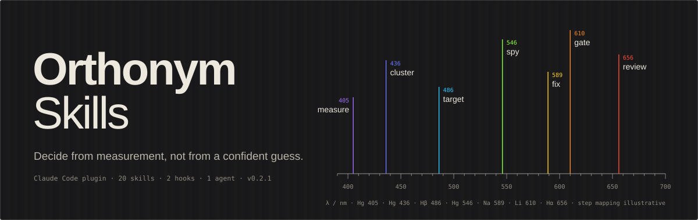
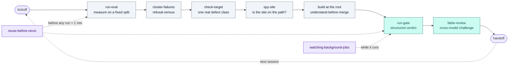

<div align="center">

<a href="https://github.com/Kohulan/stitch-skills">
  
</a>

<br/><br/>

[](LICENSE)
[](#install)
[](#the-skills)
[](#hooks)
[](#agent)
[](#cite)
[](https://orcid.org/0000-0003-1066-7792)

<br/>

**Decide from measurement, not from a confident guess.**

Skills, hooks and an agent for [Claude Code](https://docs.claude.com/en/docs/claude-code) — hardened on a
real deterministic cheminformatics engine, generalized for anyone building **chemistry software or ML
tools**: property prediction, structure ↔ name, reaction / retrosynthesis prediction, docking / QSAR,
molecular generation, cheminformatics pipelines.

[**Install**](#install) · [**The skills**](#the-skills) · [**Hooks**](#hooks) · [**Agent**](#agent) ·
[**Catalog**](docs/skills-catalog.md) · [**Cite**](#cite)

</div>

---

## Why this exists

Autonomous coding agents fail in one recurring way: a **confident-but-wrong premise** that every test
passes, because tests verify code, not reasoning. Every skill here closes one gap in that chain:

> Prove a code site is on the execution path **before** you edit it.
> Prove a fix target is a real defect class **before** you build.
> Reuse the result you already have **before** you re-measure for four hours.
> Bound your objectives **before** you optimise.
> Get an adversarial second opinion **before** you ship a load-bearing claim.
> Attribute failures to the exact site that produced them.

## The loop

The workflow skills chain into one repeatable session. Process skills (below the line) fire wherever a
decision is about to be made on trust.



## Install

**As a plugin** — everything in two commands, inside Claude Code:

```text
/plugin marketplace add Kohulan/stitch-skills
/plugin install stitch-skills@stitch-skills
```

You get all 20 skills (as `/stitch-skills:<name>`), the `reference-consult` agent, and the
`block-git-add-all` hook. The `ask-gate` hook is opt-in — see [`hooks/README.md`](hooks/README.md).

<details>
<summary><b>Copy only what you want</b></summary>

```bash
# per-project
cp -r skills/spy-site  /path/to/your/project/.claude/skills/
# user-global (every session on this machine)
cp -r skills/spy-site  ~/.claude/skills/
```

Invoke by name — `/spy-site` — or let Claude pick the skill up from its description when your task
matches. Full options, hooks and agent setup: [`docs/INSTALL.md`](docs/INSTALL.md).
</details>

<details>
<summary><b>Clone and track upstream</b></summary>

```bash
git clone https://github.com/Kohulan/stitch-skills.git ~/stitch-skills
ln -s ~/stitch-skills/skills/spy-site ~/.claude/skills/spy-site
git -C ~/stitch-skills pull      # update
```
</details>

## The skills

### 🧭 Process skills — ready to use, no setup

| Skill | When it fires | What it forces |
|---|---|---|
| [`spy-site`](skills/spy-site/) | Before any fix that names a function as "the place to change" | Instrument, run a known positive, count calls. Zero calls = wrong site. |
| [`check-target`](skills/check-target/) | Before starting a fix on a named cluster or signature | The signature must not also match inputs that already succeed. |
| [`enumerate-first`](skills/enumerate-first/) | "Probably unreachable", "edge case", "unlikely to matter" | Enumerate the space and count. The count is the answer. |
| [`verify-source`](skills/verify-source/) | "The spec says…", "per IUPAC / RFC / ISO…" | Open the source, cite the section. Never a note that quotes it. |
| [`prove-invariant`](skills/prove-invariant/) | A suite passes but you are not sure the values are *right* | Derive the invariant the output must satisfy and test that. |
| [`change-asserted-value`](skills/change-asserted-value/) | A change would move a golden file, snapshot, or asserted label | Answer "which is wrong, the code or the expectation?" with evidence first. |
| [`bounded-goals`](skills/bounded-goals/) | Writing success criteria with more than one metric | One objective, explicit bounds on the rest. Multi-objective loops thrash. |
| [`council`](skills/council/) | "Which option?", "what next?", "is X worth it?", "your call" | Search first, three named voices, one recorded call with a flip condition. |
| [`fable-review`](skills/fable-review/) | Before shipping a load-bearing plan, finding, or diagnosis | An adversarial review by a *different* model. Refute, don't agree. |
| [`gauntlet-loop`](skills/gauntlet-loop/) | "Loop until it beats X" | Builder vs. harsh critic against a stated bar, until it wins. |
| [`understand-before-merge`](skills/understand-before-merge/) | Any code meant to ship, merge, or touch real data | Inline reasoning, a failure-mode table, open questions only a human can answer. |

### 🔁 Workflow skills — wire in your project's commands once

| Skill | When it fires | What it forces |
|---|---|---|
| [`kickoff`](skills/kickoff/) | Session start, "continue", "resume" | Self-prime from the handoff note, both memory layers and `git log`; drift-check before trusting the plan. |
| [`run-eval`](skills/run-eval/) | "What is the accuracy?" | A fixed, hashed split; several numbers, so "fixed a wrong output" ≠ "stopped emitting one". |
| [`cluster-failures`](skills/cluster-failures/) | Deciding what to fix next | Group by a structural feature of the input. Analysis only, never per-item patches. |
| [`refusal-census`](skills/refusal-census/) | Ranking build order | Attribute each abstention to its code site; rank by *sole-blocker* count. |
| [`eval-loop`](skills/eval-loop/) | The improvement loop itself | measure → one class → root fix → re-measure → gate → log, with bounded goals. |
| [`reuse-before-rerun`](skills/reuse-before-rerun/) | Before any run longer than a minute; "how many…", "where is the run from…" | One sweep of ledger, repo, scratch dirs, notes. Then a 3-line **REUSE / EXTEND / RERUN** verdict. |
| [`run-gate`](skills/run-gate/) | Before shipping a phase | Background launch, wait on the verdict file, read the *structured* verdict, never the exit code. |
| [`watching-background-jobs`](skills/watching-background-jobs/) | Anything running longer than ~5 minutes | Own the watch loop; one progress line per wake-up; CPU check before calling a stall. |
| [`handoff`](skills/handoff/) | Wrapping up a session | Lessons into both memory layers; a resume note; never trim durable notes. |

<details>
<summary><b>What a skill's output looks like</b></summary>

`reuse-before-rerun` ends every reply that reports a number with this block:

```text
Existing: results/h2h/summary_chebifull_*.json · 2026-08-31 · HEAD 4133b60e
Verdict:  REUSE — no commits to src/ since the run date
Cost:     0 (reused)
```

`watching-background-jobs` ends every wake-up that shows progress with one line:

```text
gate · 2100/5000 (42%) · 40/min · ETA 08:43 UTC · last: "[2100/5000] row ok"
```
</details>

## Hooks

Mechanical guards for the two rules prose instructions kept losing under pressure. Both are
`PreToolUse` hooks; [`hooks/README.md`](hooks/README.md) has the settings block and the one-line tests.

| Hook | Matcher | Denies | Escape |
|---|---|---|---|
| [`block-git-add-all`](hooks/block-git-add-all.py) | `Bash` | `git add -A`, `git add .`, `git add --all`, `git commit -a` | Name the paths. |
| [`ask-gate`](hooks/ask-gate.py) | `AskUserQuestion` | Any question that is not one of the 4 hard stops: destructive, security / publish, 30k+ rows or 1h+ run, plan so broken every path is a guess | `HARD STOP:` prefix, `ASK_GATE_OFF=1`, `.claude/ask-gate.off` |

## Agent

[`reference-consult`](agents/reference-consult.md) — a subagent that reads the reference documents a project relies on (standards, specifications, published rules, reference data files) and returns the rule: the rule, the code site, the reference's own test
cases, what the reference gets wrong, and a confidence per finding. The main agent then re-implements
root-cause. **Documents only, never source code.**

## Reference docs

[`reference-docs/`](reference-docs/) holds domain knowledge you point Claude at (not invocable).
`rdkit-perception`, `fix-methodology`, `testing-commands` are chemistry-general. The
[`examples-iupac-naming/`](reference-docs/examples-iupac-naming/) pack is a worked example of a
domain-specific knowledge file, for when you build your own.

## Why "chemistry" and not "any code"?

The process skills are domain-neutral. The workflow skills assume the texture of chemistry-tool
development: molecules as inputs, reference-free validation by round-tripping through a parser or
canonicalizer (RDKit → canonical InChIKey), fixed benchmark splits, and pipelines that *abstain* rather
than emit a wrong structure. That framing is what makes them concrete instead of generic advice.

## Contributing

Run the release gate before a pull request:

```bash
python3 scripts/lint_skills.py        # frontmatter, names, triggers, leaked project tokens
claude plugin validate . --strict     # plugin + marketplace manifests
```

Every skill is tested the same way it was written: a baseline run **without** the skill that shows the
failure, then a run **with** it that shows compliance. Bring both to the PR.

## Cite

If these skills, hooks or the agent help your work, please cite the repository
([`CITATION.cff`](CITATION.cff) — GitHub's *Cite this repository* button reads it):

```bibtex
@software{rajan_stitch_skills_2026,
  author    = {Rajan, Kohulan},
  title     = {stitch-skills: Claude Code skills for measurement-driven chemistry development},
  year      = {2026},
  version   = {0.2.0},
  url       = {https://github.com/Kohulan/stitch-skills},
  license   = {MIT}
}
```

## License

[MIT](LICENSE) © 2026 Kohulan Rajan. Skills are instruction text — use, adapt, and redistribute freely.
